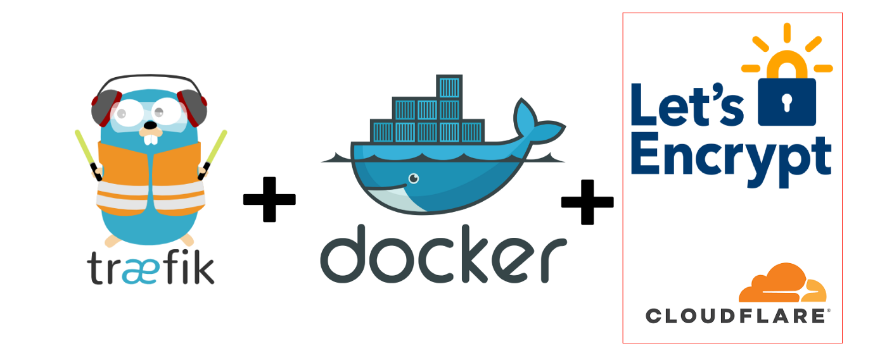

<p align="center">
  <a href="https://github.com/0-don/traefik">
    
  </a>

  <p align="center">
    <h1 align="center">Traefik & Docker with Cloudflare + Letsencrypt</h1>

  <p align="center">
    <a  href="https://github.com/0-don/clippy/issues">Report Bug</a>
    ·
    <a href="https://github.com/0-don/clippy/issues">Request Feature</a>
  </p>

</p>

## Prerequisites

Docker, docker-compose, Cloudflare

1. create .env like in .env.example

   ```sh
   touch .env
   nano .env
   ```

2. TRAEFIK_USER_PASS can be created [here](https://www.web2generators.com/apache-tools/htpasswd-generator)

3. CLOUDFLARE_DNS_API_TOKEN example is [here](https://dash.cloudflare.com/profile/api-tokens). **you need to be able to edit zone dns**

4. **Important** Change the traefik path of your volume in docker-compose.yml

5. if everything is configured correctly you can run docker

   ```sh
   docker-compose up -d
   ```

## Examples

```yaml
services:
  librespeed:
  image: ghcr.io/linuxserver/librespeed
  container_name: librespeed
  restart: unless-stopped
  networks:
    - proxy
  labels:
    - 'traefik.enable=true'
    - 'traefik.http.routers.librespeed.rule=Host(`librespeed.coding.global`)'
    - 'traefik.http.routers.librespeed.entrypoints=websecure'
    - 'traefik.http.routers.librespeed.tls.certresolver=letsencrypt'
    - 'traefik.http.services.librespeed.loadbalancer.server.port=80'

networks:
  proxy:
    external: false
    name: proxy
```
## More Examples

1. [simple static html + nginx](https://github.com/0-don/cashclock)
2. [react html frontend + nginx & express backend](https://github.com/0-don/pAlarm)
3. [nextjs frontend & graphql backend](https://github.com/0-don/echat)
3. [graphql backend](https://github.com/0-don/igdb-graphql)
4. [portainer](https://github.com/0-don/portainer)
