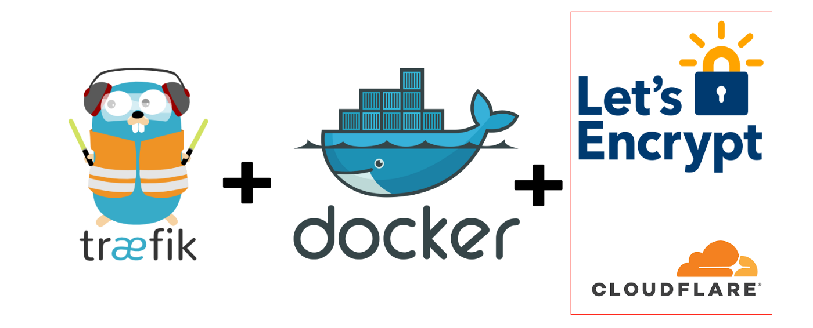

<p align="center">
  <a href="https://github.com/0-don/traefik">
    
  </a>

  <p align="center">
    <h1 align="center">Traefik & Docker with Cloudflare + Letsencrypt</h1>

  <p align="center">
    <a  href="https://github.com/0-don/clippy/issues">Report Bug</a>
    ·
    <a href="https://github.com/0-don/clippy/issues">Request Feature</a>
  </p>

</p>

## Prerequisites

Docker, docker-compose, Cloudflare

1. create .env like in .env.example

   ```sh
   touch .env
   nano .env
   ```

2. TRAEFIK_USER_PASS can be created [here](https://www.web2generators.com/apache-tools/htpasswd-generator)

3. CLOUDFLARE_DNS_API_TOKEN example is [here](https://dash.cloudflare.com/profile/api-tokens). **you need to be able to edit zone dns**

4. **Important** Change the traefik path of your volume in docker-compose.yml

5. if everything is configured correctly you can run docker

   ```sh
   docker-compose up -d
   ```

## Cloudflare Tunnel Setup

This setup routes all traffic through a Cloudflare Tunnel, meaning ports 80 and 443 are never exposed to the public internet. The `cloudflared` container connects outbound to Cloudflare, and Cloudflare forwards requests back through the tunnel to Traefik.

### 1. Create a Tunnel

Go to [Cloudflare Zero Trust](https://one.dash.cloudflare.com/) > Networks > Tunnels > Create a tunnel. Select **Cloudflared** as the connector type.

### 2. Configure Public Hostnames

In the tunnel settings, add public hostname entries for each domain. For each entry:

| Field    | Value              |
| -------- | ------------------ |
| Hostname | `*.yourdomain.com` |
| Type     | HTTPS              |
| URL      | `traefik:443`      |

Enable **No TLS Verify** under "Additional application settings > TLS" since `cloudflared` connects via Docker internal DNS (`traefik`) which won't match the certificate hostname.

Add entries for both the wildcard (`*.yourdomain.com`) and the apex (`yourdomain.com`) for each domain.

### 3. Update DNS Records

All DNS records must point to the tunnel instead of your server IP. Replace any A records with CNAME records:

| Type  | Name | Content                                    | Proxied |
| ----- | ---- | ------------------------------------------ | ------- |
| CNAME | `@`  | `<tunnel-id>.cfargotunnel.com` | Yes     |
| CNAME | `*`  | `<tunnel-id>.cfargotunnel.com` | Yes     |

You can find your tunnel ID in the Zero Trust dashboard or by running `cloudflared tunnel list`.

### 4. Add the Tunnel Token

Copy the tunnel token from the Zero Trust dashboard and add it to your `.env`:

```sh
CLOUDFLARE_TUNNEL_TOKEN=eyJhIjoiN2...
```

If using GitHub Actions, also add `CLOUDFLARE_TUNNEL_TOKEN` as a repository secret.

### 5. Firewall

Since traffic now flows through the tunnel, block ports 80 and 443 at the OS level as a safety net:

```sh
ufw deny 80
ufw deny 443
```

The docker-compose already binds these ports to `127.0.0.1` only, but OS level firewall rules provide an extra layer of protection.

### 6. Deploy

```sh
docker compose up -d
```

Verify the tunnel is healthy:

```sh
docker logs cloudflared
# Should show "Registered tunnel connection" messages
```

## Examples

```yaml
services:
  librespeed:
  image: ghcr.io/linuxserver/librespeed
  container_name: librespeed
  restart: unless-stopped
  networks:
    - proxy
  labels:
    - "traefik.enable=true"
    - "traefik.http.routers.librespeed.rule=Host(`librespeed.coding.global`)"
    - "traefik.http.routers.librespeed.entrypoints=websecure"
    - "traefik.http.routers.librespeed.tls.certresolver=letsencrypt"
    - "traefik.http.services.librespeed.loadbalancer.server.port=80"

networks:
  proxy:
    external: false
    name: proxy
```

## More Examples

1. [simple static html + nginx](https://github.com/0-don/cashclock)
2. [react html frontend + nginx & express backend](https://github.com/0-don/pAlarm)
3. [nextjs frontend & graphql backend](https://github.com/0-don/echat)
4. [graphql backend](https://github.com/0-don/igdb-graphql)
5. [portainer](https://github.com/0-don/portainer)
